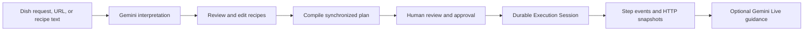
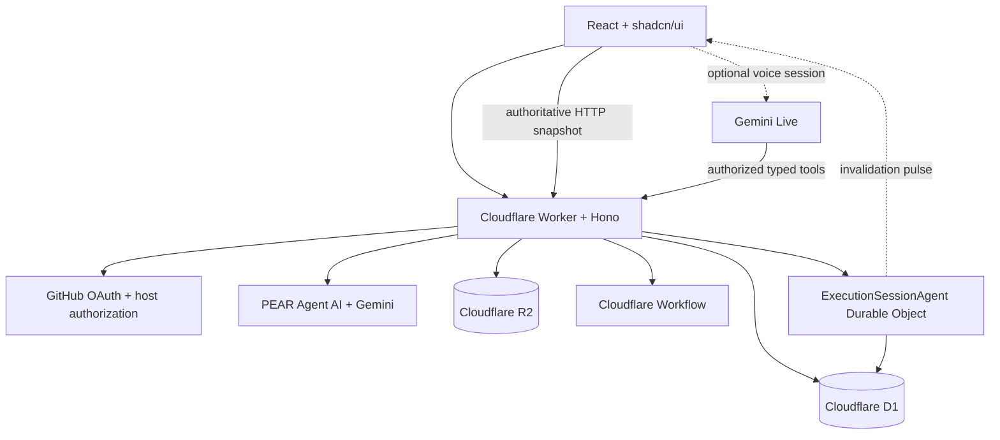
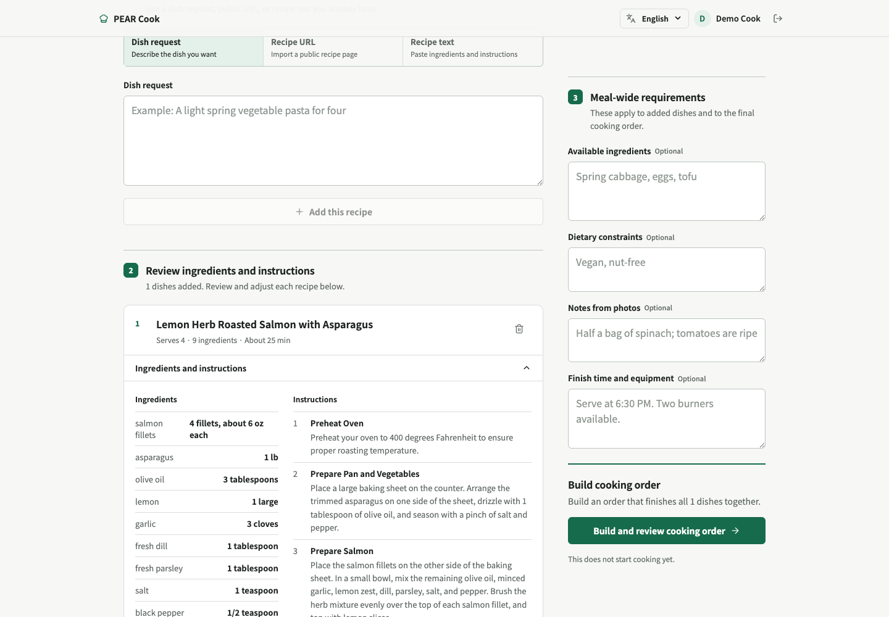
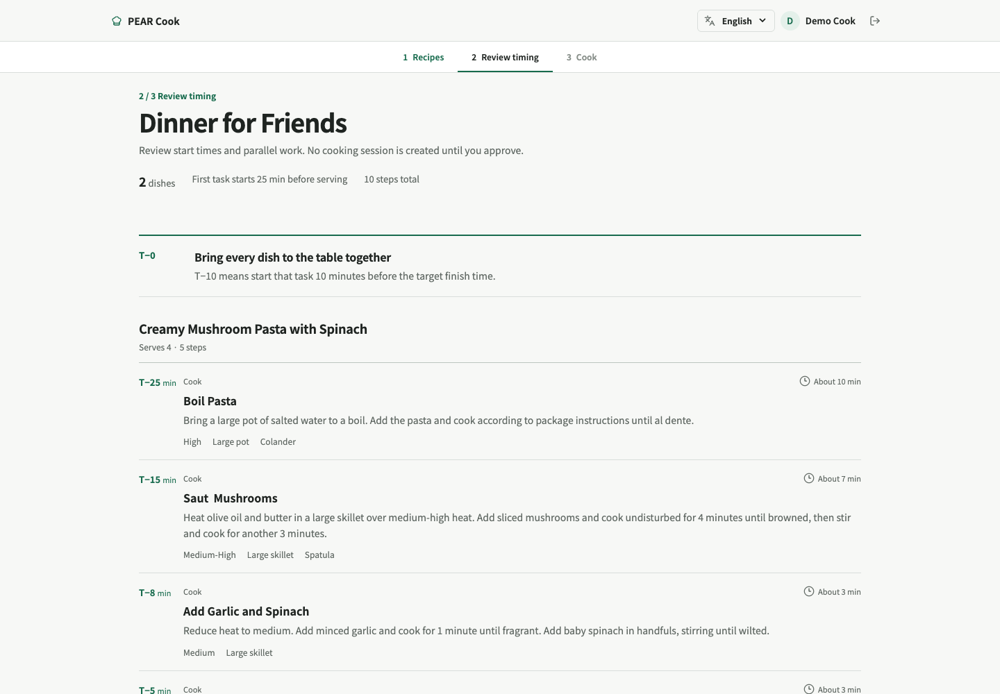
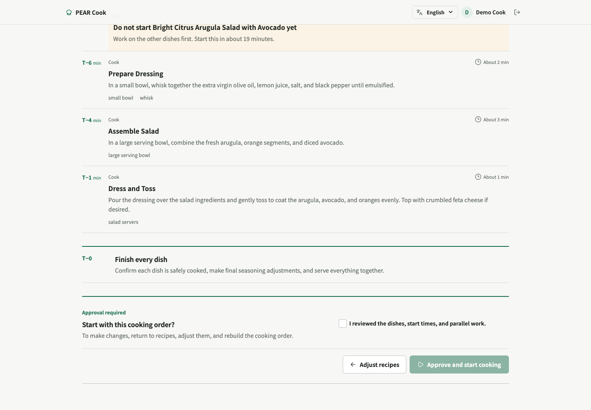
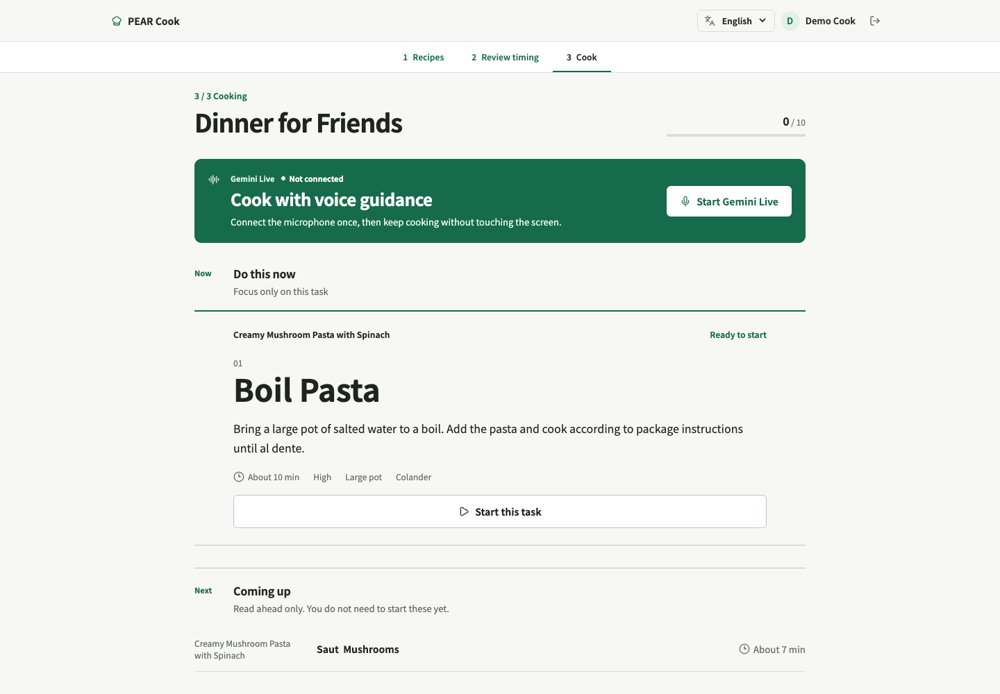
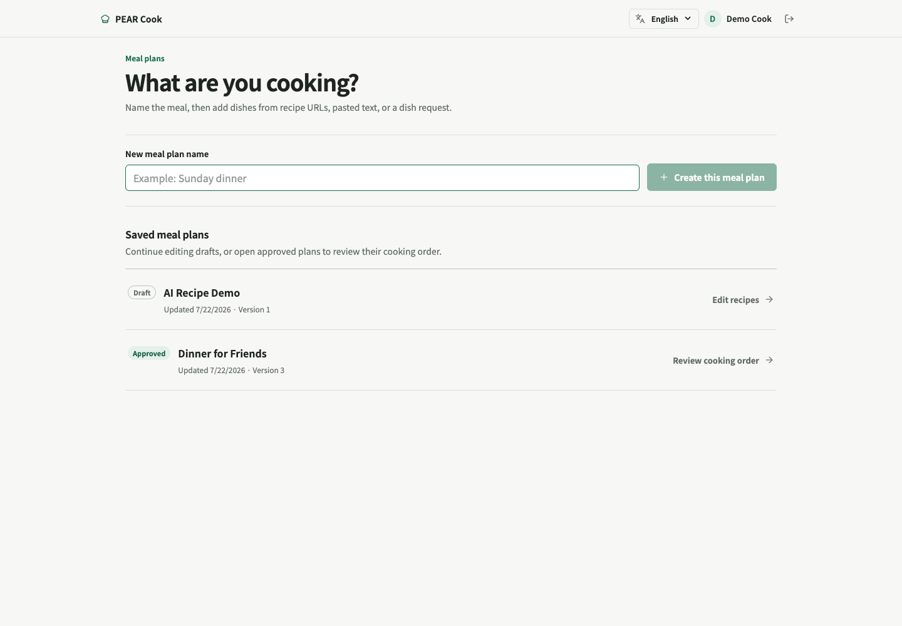
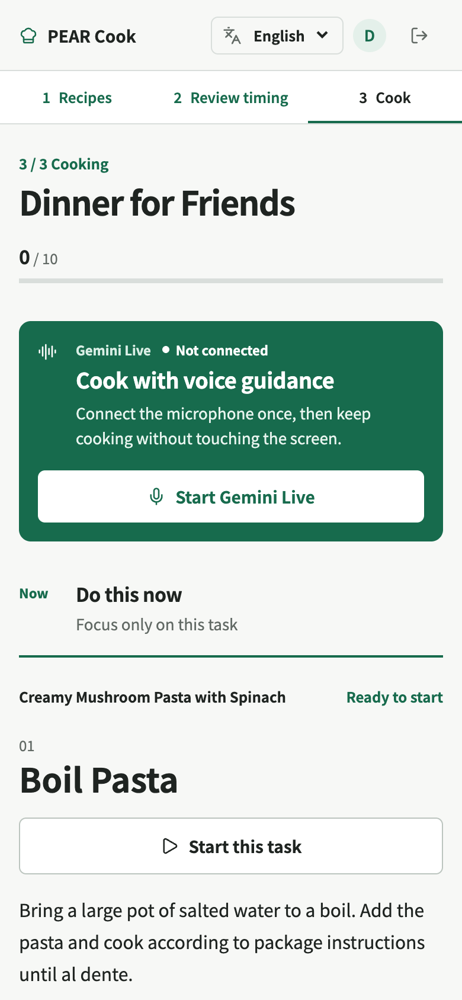

# PEAR Cook

**PEAR Cook turns recipes, ingredients, and kitchen constraints into one coordinated cooking session.**

A cook can describe a dish, import a public recipe URL, or paste recipe text; review and edit the extracted ingredients and instructions; generate a multi-recipe timeline; and start a durable execution session only after explicit human approval.

**Live app:** https://pear-cook.aomona.workers.dev/

[Watch the English video demo](artifacts/pear-cook-demo.mp4)

## Why PEAR Cook

Following one recipe is straightforward. Cooking several dishes so they finish together is not. Each dish has its own preparation, active cooking, resting time, equipment requirements, and serving deadline. PEAR Cook combines those independent recipes into a shared plan that answers three practical questions:

1. What should I do now?
2. What can I safely do in parallel?
3. When should each dish begin so everything reaches the table together?

AI output remains a proposal. The cook reviews the extracted recipe and compiled timeline before the application creates an Execution Session.

## What it does

- Offers a read-only interactive sample before sign-in; protected data and providers remain inaccessible.
- Signs users in with GitHub OAuth and PKCE.
- Accepts dish requests, public recipe URLs, and pasted recipe text.
- Captures available ingredients, dietary constraints, equipment limits, finish-time requirements, and notes derived from photos.
- Uses Gemini to extract structured recipes with ingredients, quantities, instructions, duration, temperature, equipment, safety notes, and source provenance.
- Generates optional finished-dish previews with Google AI, stores the generated image in R2, and labels it as an AI preview that may differ from the actual result.
- Keeps every extracted recipe reviewable and editable.
- Supports natural-language recipe adjustments such as changing servings or removing an ingredient.
- Compiles multiple recipes into one dependency-aware cooking timeline.
- Enforces one-cook hands-on safety plus configured burner and oven capacities while scheduling backward from the shared finish.
- Represents passive waiting separately from active work, allowing another dish to progress during rests or delays.
- Requires an explicit review checkbox and approval action before starting execution.
- Presents a focused **Do this now / Coming up / Full cooking order** interface.
- Persists multiple cooking timers, notification preferences, and screen-wake controls across reloads.
- Supports approval-gated partial replanning for substitutions, delays, equipment changes, and doneness facts without rewriting completed work.
- Captures per-recipe post-cook difficulty and actual duration to personalize later timing estimates.
- Provides optional Gemini Live voice guidance without making the voice connection the source of truth.
- Preserves the durable cooking session when voice disconnects or the page reloads.
- Supports Japanese and English, including loading, empty, error, approval, execution, voice, and accessibility states.
- Localizes canonical ingredient units and allergen labels for Japanese and English.
- Works on desktop and mobile.

## Product flow



The core path is:

**Sources → Interpret → Review and edit → Compile → Approve → Execute**

## Built with Codex

Codex was used for the complete engineering workflow behind PEAR Cook—not only for isolated code suggestions.

I used Codex to:

- define the cooking Domain and its typed boundaries;
- implement the React and shadcn/ui interface;
- build GitHub OAuth, fail-closed authorization, and ownership checks;
- integrate PEAR Agent, Gemini, Gemini Live, Cloudflare Workers, D1, R2, Durable Objects, and Workflows;
- design the multi-recipe planner and approval-gated execution flow;
- add Japanese and English localization;
- diagnose bugs, run browser-based QA, perform independent self-review loops, and fix every blocking finding until the reviewer returned `APPROVE`;
- provision Cloudflare resources, apply production migrations, configure secrets, update the GitHub OAuth callback, deploy the Worker, and smoke-test the production application;
- drive the real production interface to create the demo data;
- record and edit the product video, including a real Gemini recipe-generation request; and
- capture, compose, and verify every image in the gallery below.

The video and screenshots are therefore not manually mocked marketing assets. Codex operated the deployed product, exercised its real UI, captured frames, assembled the gallery, and encoded the final H.264 demo.

There is another layer to this story: **PEAR Agent—the execution framework used by PEAR Cook—was itself built with Codex and GPT-5.6.** PEAR Cook demonstrates software created with Codex running on top of an agent framework that was also created with Codex.

My role was product direction, requirements, taste, and approval. Codex handled the implementation, verification, deployment workflow, and media-production workflow under that direction.

## Architecture



### Technology

| Area | Technology |
| --- | --- |
| Agent runtime | PEAR Agent Core, AI, Cloudflare, and React packages |
| AI | Gemini structured generation, Gemini Live, Google AI SDK, AI SDK |
| Frontend | React 19, TypeScript, Vite, shadcn/ui patterns, Radix UI, Lucide |
| Data fetching | TanStack Query and PEAR React hooks |
| API | Cloudflare Workers and Hono |
| Durable execution | PEAR Execution Sessions and `ExecutionSessionAgent` Durable Object |
| Compilation | Cloudflare Workflows |
| Database | Cloudflare D1 |
| Source storage | Cloudflare R2 |
| Validation | Zod and deterministic Domain validation |
| Authentication | GitHub OAuth, PKCE, signed HTTP-only sessions |
| Testing | Vitest, TypeScript typecheck, production browser smoke paths |
| Deployment | Wrangler and Cloudflare Workers Assets |

## Domain and safety boundaries

PEAR Cook treats generated content as untrusted input until it passes typed and deterministic validation.

- Domain contracts remain environment-independent.
- Gemini keys and provider configuration stay in the Worker.
- Production authorization is fail-closed.
- Requests are rejected before D1, R2, or AI work when the principal is missing or unauthorized.
- Plans, recipes, sources, and sessions are owner-scoped to the authenticated GitHub actor.
- AI output cannot mutate execution state directly.
- Runtime changes use typed PEAR events.
- HTTP snapshots are authoritative; WebSockets only signal clients to refetch.
- D1 event append and materialized-state updates follow PEAR's atomic execution path.
- A Plan Artifact becomes ready only through the review action.
- Session creation requires a ready plan and explicit human approval in the UI.
- Voice is ephemeral; muting or disconnecting it never stops durable execution.

## Image gallery

| AI-generated recipe review | Synchronized multi-recipe plan |
| --- | --- |
|  |  |

| Human approval boundary | Live cooking workspace |
| --- | --- |
|  |  |

| Meal plans | Mobile cooking experience |
| --- | --- |
|  |  |

Additional timeline detail: [coordinated cooking timeline](artifacts/gallery/04-coordinated-timeline.png).

## Local development

### Requirements

- Node.js 20+
- pnpm
- A Cloudflare account
- A Gemini API key
- A GitHub OAuth App

### Setup

```bash
pnpm install
cp .env.example .env
cp .dev.vars.example .dev.vars
pnpm db:migrate:local
pnpm dev
```

Set these Worker-only values in `.dev.vars`:

```dotenv
GEMINI_API_KEY=
SESSION_SECRET=
GITHUB_CLIENT_ID=
GITHUB_CLIENT_SECRET=
GITHUB_CALLBACK_URL=http://localhost:5173/auth/github/callback
```

`SESSION_SECRET` must contain at least 32 random characters.

For local development only, `PEAR_LOCAL_DEV_AUTH=true` enables the **Use local cook** button on `localhost` and `127.0.0.1`. Never set that flag on the deployed Worker. Production has no allow-all authorization path.

`GEMINI_API_KEY` must never be exposed through a `VITE_*` variable or browser bundle.

## Verification

```bash
pnpm typecheck
pnpm test
pnpm build
```

The final application was also exercised through real browser paths in Japanese and English, at desktop and mobile sizes, and against the deployed Worker. The OAuth redirect sanitizer, production authorization boundary, D1 plan read, AI recipe generation, approval transition, Execution Session creation, and step update path were all exercised directly.

## Deploying to Cloudflare Workers

Create the production resources and update their bindings in `wrangler.jsonc`:

```bash
pnpm wrangler d1 create pear-cook
pnpm wrangler r2 bucket create pear-cook-inputs
```

Install these values as Wrangler secrets:

- `GEMINI_API_KEY`
- `SESSION_SECRET`
- `GITHUB_CLIENT_ID`
- `GITHUB_CLIENT_SECRET`

Then apply migrations and deploy:

```bash
pnpm db:migrate:remote
pnpm run deploy
```

Register the deployed callback in the GitHub OAuth App:

```text
https://<worker-domain>/auth/github/callback
```

After deployment, verify `/health`, confirm that `/auth/session` returns `401` without a valid signed session, complete GitHub login, and exercise an authenticated D1-backed page before testing recipe generation or execution.

## Production deployment

- Worker: https://pear-cook.aomona.workers.dev/
- D1: production `pear-cook` database
- R2: production `pear-cook-inputs` bucket
- Workflow: `pear-plan-compile`
- Durable Object: `ExecutionSessionAgent`

## Project status

The guided-cooking slice is complete:

- fail-closed GitHub login and an unauthenticated read-only sample;
- AI dish requests, URL, and text recipe sources with editable structured extraction, plus optional AI-generated dish previews;
- provenance, confidence, localized units, and allergen review;
- capacity-aware, synchronized multi-recipe planning;
- explicit human approval before durable execution;
- persistent timers, notifications, wake lock, undo, focus, and high-contrast cooking controls;
- approval-gated partial replanning that preserves completed work;
- post-cook feedback and personalized duration estimates;
- optional Gemini Live guidance with reconnect handling;
- Japanese and English responsive interfaces; and
- Cloudflare D1, R2, Workflow, Durable Object, and Worker integration.

Potential extensions include collaborative cooking sessions, nutrition summaries, and additional languages.
